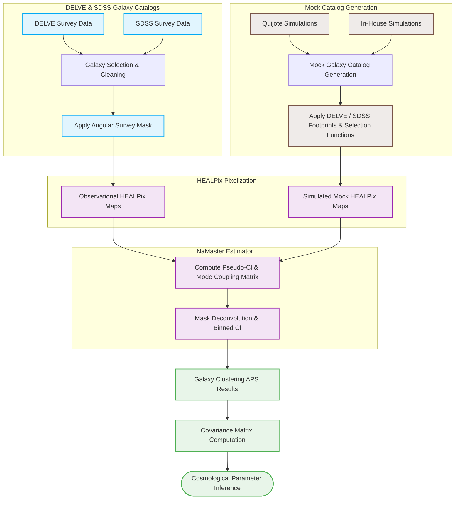

# cosmology-galaxy-clustering-aps

### Presentation Slides
You can download the senior seminar presentation here:
[Download senior seminar presentation (PPTX)](senior-seminar presentation-slides.pptx)
